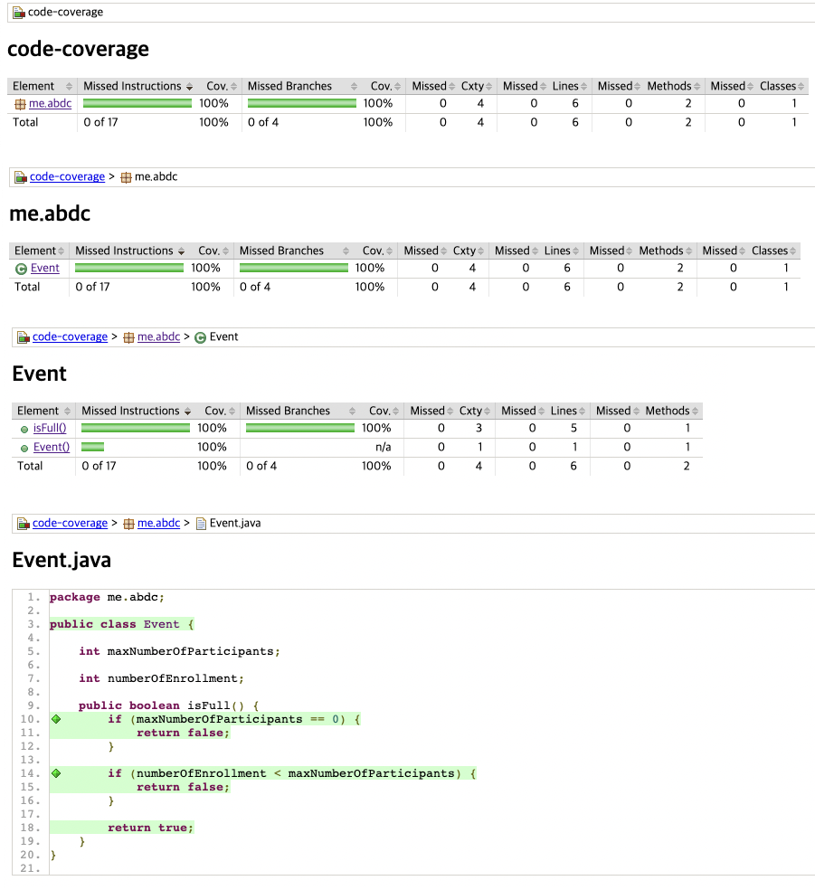

## 코드 커버리지 측정 방법

### 코드 커버리지란?

소프트웨어의 테스트를 논할 때 얼마나 테스트가 충분한가를 나타내는 지표중 하나다. 말 그대로 코드가 얼마나 커버되었는가이다. 소프트웨어 테스트를 진행했을 때 코드 자체가 얼마나 실행되었냐는 것이다.

코드의 구조를 이루는 것은 크게 구문(Statement), 조건(Condition), 결정(Decision)이다. 이러한 구조를 얼마나 커버했느냐에 따라 코드 커버리지의 측정기준은 나뉘게 된다.

- **구문(Statement) 커버리지**
    - 일반적으로 많이 사용되는 커버리지이며, 실행 코드라인이 한 번 이상 실행 되면 충족된다. 
- **조건(Condition)커버리지**
    - 각 내부 조건이 참 혹은 거짓을 가지면 충족된다.
- **결정(Decision)커버리지**
    - 각 분기의 내부 조건자체가 아닌 이러한 조건으로 인해 전체 결과가 참 혹은 거짓이면 충족된다. 
- MC/DC 커버리지
    - 조건과 결정을 복합적으로 고려하는 커버리지

### 코드 커버리지는 어떻게 측정할까?

코드 커버리지 툴은 여러개가 있지만 다음 JaCoCo를 사용한 간단한 예제를 통해 알아보자.

**pom.xml**

```xml
<build>
    <plugins>
        <plugin>
            <groupId>org.apache.maven.plugins</groupId>
            <artifactId>maven-surefire-plugin</artifactId>
            <version>3.0.0-M7</version>
        </plugin>
        <plugin>
            <groupId>org.jacoco</groupId>
            <artifactId>jacoco-maven-plugin</artifactId>
            <version>0.8.8</version>
            <executions>
                <execution>
                    <goals>
                        <goal>prepare-agent</goal>
                    </goals>
                </execution>
                <execution>
                    <id>report</id>
                    <phase>prepare-package</phase>
                    <goals>
                        <goal>report</goal>
                    </goals>
                </execution>
            </executions>
        </plugin>
    </plugins>
</build>
```

**Event.java**

```java
public class Event {

    int maxNumberOfParticipants;

    int numberOfEnrollment;

    public boolean isFull() {
        if (maxNumberOfParticipants == 0) {
            return false;
        }

        if (numberOfEnrollment < maxNumberOfParticipants) {
            return false;
        }

        return true;
    }
}
```

**EventTest.java**

```java
import org.junit.jupiter.api.Test;

import static org.junit.jupiter.api.Assertions.*;

class EventTest {

    @Test
    void isFull() {
        Event event = new Event();
        event.maxNumberOfParticipants = 0;

        assertFalse(event.isFull());

        event.maxNumberOfParticipants = 100;
        event.numberOfEnrollment = 10;

        assertFalse(event.isFull());

        event.numberOfEnrollment = 100;

        assertTrue(event.isFull());
    }
}
```

**메이븐 빌드**

```shell
mvn clean verify
```

<br>

빌드 후 target 디렉토리의 추출물 중 jacoco 관련 내용을 확인해보면 코드 커버리지 결과물을 확인할 수 있다.



- Line Color 별 가이드
    - 노란색(Yellow): 분기문에서 일부분만 실행되었을 경우 노란색 다이아몬드 (지나가긴 했지만 완벽히 지나가지 않았다.)
    - 빨간색(Red): 테스트가 이뤄지지 않은 경우 (아예 지나가지 않은 부분)
    - 녹색(Green): 정상적으로 테스트가 된 경우